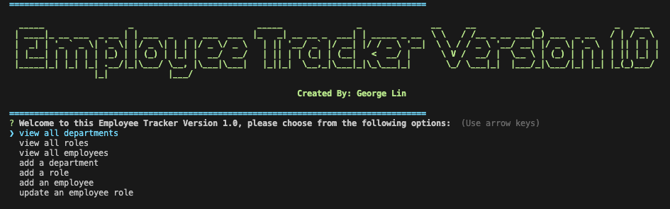

<h1 align="center">MySQL Employee Tracker👋</h1>
  

    
    
    
    
    

  

    
    
    
    
    
    
    
    

   
## Description

⌨️ 💻 This is a command-line application built with nodeJS that is able to take user input and populate a company's database displaying members of the company.

  
💻 Below is the gif showing the functionality of the application:
  

  
🎥 Video demonstration of the application can be found [here](./assets/employee-tracker.webm)  
  
  
## Table of Contents
- [Description](#description)
- [User Story](#user-story)
- [Acceptance Criteria](#acceptance-criteria)
- [Table of Contents](#table-of-contents)
- [Installation](#installation)
- [Usage](#usage)
- [Testing](#testing)
- [Contributing](#contributing)
- [Questions](#questions)

## Installation
💾   

1. Clone or download this github repository onto local directory, open the directory in any code editor (VScode used in demonstration).

2. Open a new terminal inside the "Develop" folder and run the following command: 

`npm i`
  
  
## Usage
💻   👨‍🔧  👩‍🔧

1. Open Mysql with the following command:

`mysql -u root -p`

2. Create database and populate database with pre-seeded data or user-defined data by running the following commands: 

`source schema.sql`

`source seeds.sql`

Run the following command at the root of your project and answer the prompted questions:
  
`npm start`

## Testing
✏️

No testing is currently set up

## Contributing
:octocat: [George Lin](https://github.com/lingeorge88)

## Questions
✉️ Contact me with any questions: [email](mailto:jpd@dewoodyoil.com) , [GitHub](https://github.com/jpd61) 
